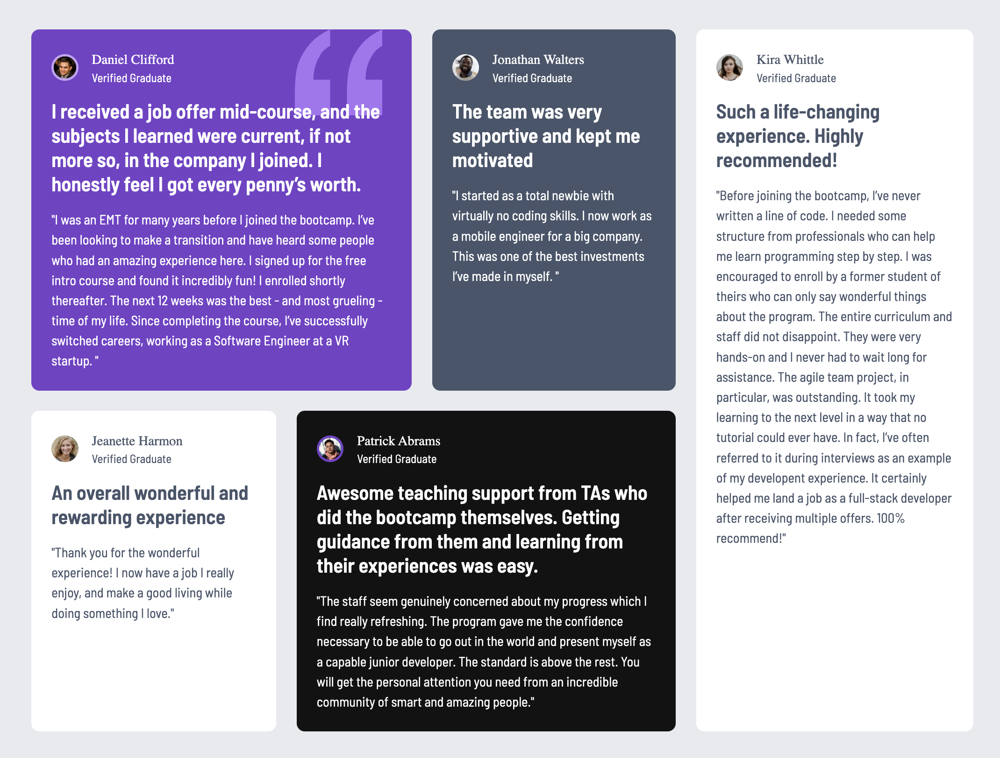

# Frontend Mentor - Testimonials grid section solution

This is a solution to the [Testimonials grid section challenge on Frontend Mentor](https://www.frontendmentor.io/challenges/testimonials-grid-section-Nnw6J7Un7). Frontend Mentor challenges help you improve your coding skills by building realistic projects.


## Table of contents

- [Frontend Mentor - Testimonials grid section solution](#frontend-mentor---testimonials-grid-section-solution)
  - [Table of contents](#table-of-contents)
  - [Overview](#overview)
    - [The challenge](#the-challenge)
    - [Screenshot](#screenshot)
    - [Links](#links)
  - [My process](#my-process)
    - [Built with](#built-with)
    - [What I learned](#what-i-learned)
    - [Continued development](#continued-development)
    - [Useful resources](#useful-resources)
  - [Author](#author)
  - [Acknowledgments](#acknowledgments)

## Overview

### The challenge

Users should be able to:

- View the optimal layout for the site depending on their device's screen size

### Screenshot




### Links

- Solution URL: [Repo](https://github.com/serfoll/fm-testimonial-grid-section)
- Live Site URL: [Add live site URL here](https://your-live-site-url.com)

## My process

### Built with

- Semantic HTML5 markup
- CSS Grid
- Mobile-first workflow

### What I learned

During this challenge I tried using clamp() for variable font-size variable font-size.

```css
/* variable font-sizes */
heading {
  font-size: clamp(var(1.5rem), 3vw, var(2rem));
}
```

Nesting `@media` under respective elements.

```css
/* grid layout */
.cards-grid {
  display: grid;
  inline-size: min(90%, 70rem);
  gap: var(--spaing-md);
  grid-template-areas:
    'one'
    'two'
    'three'
    'four'
    'five';

  @media (32rem <= width <= 64rem) {
    grid-template-areas:
      'one one'
      'two five'
      'three five'
      'four four';
  }

  @media (width > 64rem) {
    grid-template-areas:
      'one one two five'
      'three four four five';
  }
}
```

### Continued development

In the future I would like to tried more complex and different layouts using CSS grid template and rows.

### Useful resources

- [Kevin Powell - Learn CSS Grid the easy way](https://www.youtube.com/watch?v=rg7Fvvl3taU) - This helped me with understanding the foundations of CSS grid and using grid-template-columns/grid-template-areas.
- [CSS Grid Garden](https://cssgridgarden.com) - This is an amazing game to better under understand grid templates columns and rows, and how to align elments inside a grid box.

## Author

- Github - [serfoll](https://www.github.com/serfoll)
- Frontend Mentor - [@serfoll](https://www.frontendmentor.io/profile/serfoll)
- Twitter - [@sergio_fol](https://www.twitter.com/sergio_fol)

## Acknowledgments

Special thanks to my teachers at Lexicon Academy.
